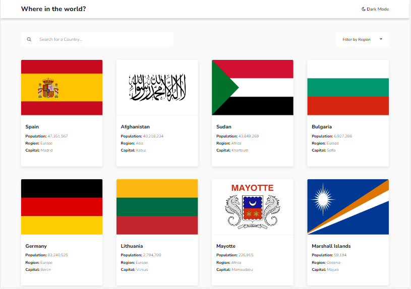
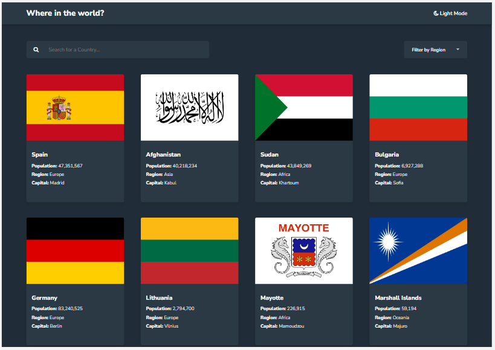
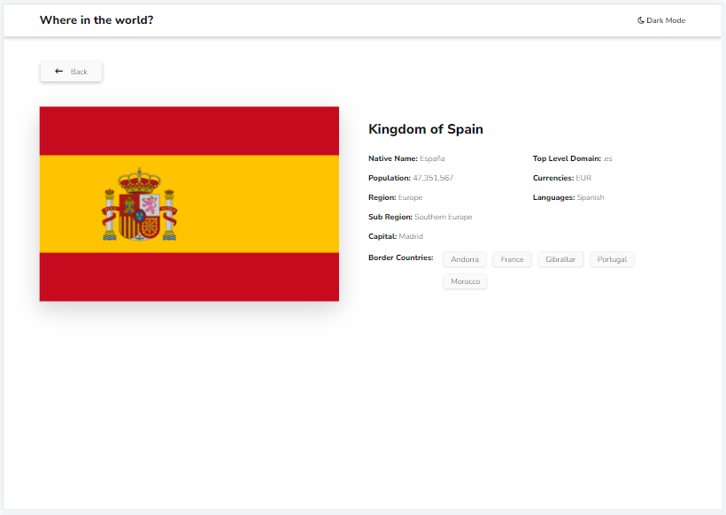

# React Flag Project

## Introduction

Welcome to our project, where we bring you the world's flag and country details in a visually stunning and user-friendly interface. Our application fetches flag and country details from an API and displays the flags on the home screen for each country. Clicking on a flag navigates the user to a new screen that provides detailed information about the flag, including the country it represents, the continent it belongs to, and other relevant details.

But our project goes beyond just displaying flag and country details. We understand that users have different preferences for viewing the application, which is why we have incorporated both dark and light mode themes to cater to all preferences. Additionally, we have included a search feature to allow users to quickly and easily find specific flags and countries.

We also understand that users may have a particular interest in exploring specific regions of the world, which is why we have included a region filter that enables users to filter flags and countries by region. This adds another layer of personalization and customization to our application, ensuring that users can explore the world in a way that meets their individual interests and preferences.

Our project is designed with the user in mind, providing a powerful yet intuitive tool for exploring the world's flags and countries. Whether you are a student, a researcher, or simply someone who loves to learn about the world, our application is the perfect tool for you. Join us on this journey of discovery as we explore the rich history and culture of flags and countries around the world.

### Home Page

### Home Page Dark

### Country Detail

## Getting Started

To get started with this project, clone this repository to your local machine:

### `git clone https://github.com/Muaviya-ShayanSolutions/React_Project_Task.git`

Next, install the dependencies using npm:

### `npm install`

Finally, start the development server:

### `npm start`

The application will be available at http://localhost:3000.

## Prerequisites

To run this project, you will need following installed on your machine.

- Node : 19.9.0
- npm : 9.6.3

## Dependencies

- redux : 4.2.1
- redux-persist : 6.0.0
- react-router-dom : 6.11.0
- react-scripts : 5.0.1
- font/nunito : 1.0.3
- web-vitals : 2.1.4
- @fortawesome/fontawesome-svg-core : 6.4.0

## Usage

To use the application, navigate to http://localhost:3000 in your web browser.

## Built With

- React
- JSX
- CSS

## Authors

Muaviya Imran
